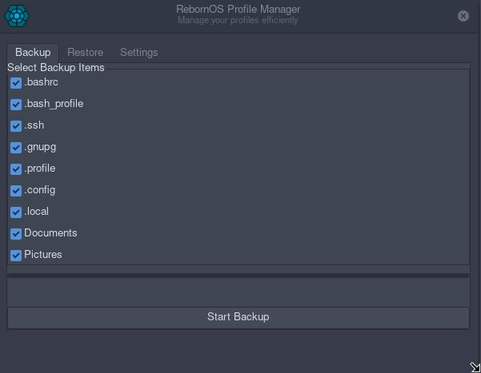
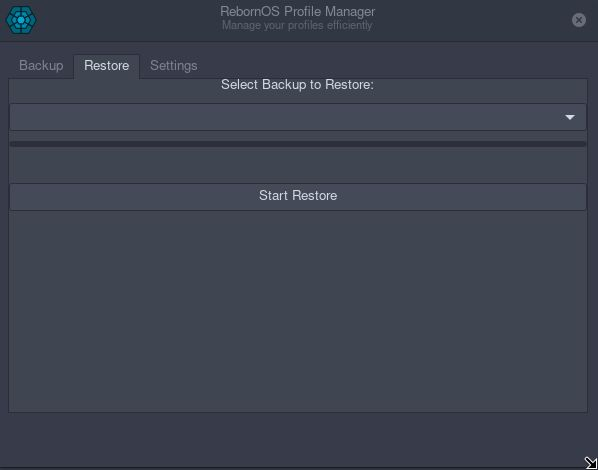
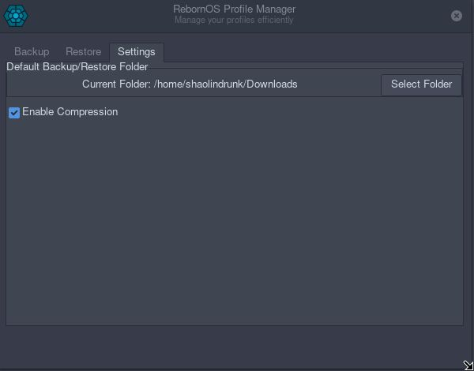

# RebornOS Profile Manager

RebornOS Profile Manager is a user-friendly tool for creating and restoring backups of important user profile data on Linux operating systems. Designed with simplicity and functionality in mind, making it easy to manage backups and restores of your most important files and directories with just a few clicks.

---

## Features

1. **Backup Profiles:**
   - Create backups of user profiles, including specific files and directories.
   - Supports both single-level and recursive folder selections.
   - Option to enable compression for smaller backup files.

2. **Restore Profiles:**
   - Restore profiles from previously created backups.

3. **Customizable Backup Items:**
   - Predefined items like `.bashrc`, `.config`, `.local`, `Documents`, and `Pictures`.
   - Dynamic folder selection for recursive backups (e.g., `.config`, `.local`).

4. **Exclusion Support:**
   - Exclude specific files or folders from backups using the `EXCLUDED_ITEMS` list.

5. **Progress Indicators:**
   - Smooth progress bars for backup and restore operations.
   - Spinner animations during ongoing processes.

6. **GUI Enhancements:**
   - Intuitive tab-based interface for backup, restore, and settings.
   - Tree view for selecting subfolders in recursive directories.

7. **Settings:**
   - Select the default save location for backups and restores.
   - Toggle compression on/off.

---

## Installation

### For Arch Linux and Arch-Based Distributions

#### Prerequisites
- **Python 3.12 or later**
- **Python PyGObject**
- **GTK 3**
  ```bash
  sudo pacman -S python python-gobject gtk3
  ```

#### Install Using the PKGBUILD File

1. Clone the repository:
   ```bash
   git clone https://github.com/DrunkenAlcoholic/Reborn-Profile-Manager.git
   cd Reborn-Profile-Manager
   ```

2. Build and install the package:
   ```bash
   makepkg -si
   ```

   This will:
   - Install the `rebornos-profile-manager` script to `/usr/bin/rebornos-profile-manager`.

3. Run the application:
   ```bash
   rebornos-profile-manager
   ```

### For Other Linux Distributions

#### Prerequisites
- **Python 3.12 or later**
- **GTK 3**
  - Install GTK and Python GObject bindings using your distribution's package manager.
    - Example for Debian-based systems:
      ```bash
      sudo apt install python3-gi gir1.2-gtk-3.0
      ```

#### Running the Application

1. Clone the repository:
   ```bash
   git clone https://github.com/DrunkenAlcoholic/Reborn-Profile-Manager.git
   cd Reborn-Profile-Manager
   ```

2. Make the Python script executable:
   ```bash
   chmod +x rebornos-profile-manager.py
   ```

3. Run the application:
   ```bash
   ./rebornos-profile-manager.py
   ```

---

## Usage

1. **Backup Tab:**
   - Select items to include in the backup.
   - For recursive folders (e.g., `.config`), select specific subfolders in the tree view.
   - Click `Start Backup` to create a backup.

2. **Restore Tab:**
   - Use the dropdown menu to select a backup file.
   - Click `Refresh List` to update the dropdown if new backups are added while the application is running.
   - Click `Start Restore` to begin restoring the selected backup.
   - Respond to the warning dialog if a restore might overwrite existing configurations.

3. **Settings Tab:**
   - Change the default save location for backups and restores.
   - Toggle compression to enable/disable creating `.tar.gz` files.


---

## Screenshots

### Backup Tab



### Restore Tab



### Settings Tab



---

## Contributing

Contributions are welcome! Please follow these steps:

1. Fork the repository.
2. Create a new branch:
   ```bash
   git checkout -b feature-name
   ```
3. Commit your changes:
   ```bash
   git commit -m "Add new feature"
   ```
4. Push to your branch:
   ```bash
   git push origin feature-name
   ```
5. Open a pull request.

---

## License

This project is licensed under the GPLv3 License. See the [LICENSE](LICENSE) file for details.


---

## Contact

For issues or feature requests, please open an issue in the [GitHub repository](https://github.com/DrunkenAlcoholic/Reborn-Profile-Manager/issues).


